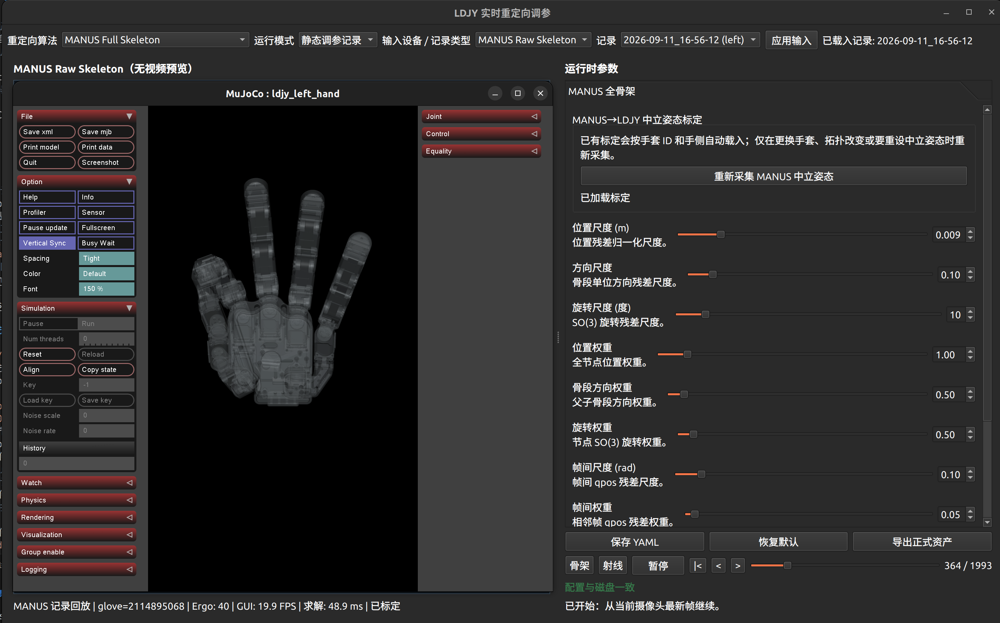

# LDJY Hand Retargeting

将人手追踪数据重定向为 LDJY 五指灵巧手的 20 个关节角，并在 MuJoCo 中实时检查结果。项目用于研究、调参与离线回放：只输出仿真 `qpos[20]`，不向真机发送控制命令。



## 目录

- [支持范围](#支持范围)
- [运行环境](#运行环境)
- [部署](#部署)
- [快速开始](#快速开始)
- [输入源](#输入源)
- [MANUS 手套](#manus-手套)
- [录制、回放与测试](#录制回放与测试)
- [仓库结构与文档](#仓库结构与文档)

## 支持范围

| 能力 | 状态 | 输出 |
| --- | --- | --- |
| USB 摄像头 + MediaPipe | 支持 | 21 点 → LDJY `qpos[20]` |
| USB 摄像头 + WiLoR | 支持，需模型与 CUDA 环境 | MANO 21 点/指腹任务 → `qpos[20]` |
| Quest Hand Tracking Streamer | 支持 | Quest 21 点 → `qpos[20]` |
| MANUS Raw Full Skeleton | 支持 | 完整 Raw Skeleton → 有界 IK → `qpos[20]` |
| MANUS Ergonomics Hybrid | 支持 | Ergonomics + Raw Skeleton → `qpos[20]` |
| LDJY 真机电机控制 | 不在本仓库范围 | — |

所有实时路径均在 MuJoCo 中显示目标与实际手形，关节上下限由左右手 URDF 强制约束。

## 运行环境

本仓库的开发与 MANUS 工作流以 **Ubuntu Linux 图形桌面** 为目标；Windows 和 macOS 没有作为当前发布流程验证。

- Python：`3.10`（受 `>=3.10,<3.11` 约束）。
- 包管理：[`uv`](https://docs.astral.sh/uv/)。
- GUI：可用的 X11 或 Wayland 图形会话；MuJoCo 会另开窗口。
- MediaPipe：普通 USB 摄像头即可。
- WiLoR：需要 CUDA/PyTorch 环境，以及额外的模型权重与 MANO 许可资产。
- Quest：需要安装对应 Python extra，并由 Quest HTS 发送数据。
- MANUS：需要 MANUS Core 3.2 Linux Integrated 授权、已配对手套与接收器；SDK 是外部依赖，不包含在 `pyproject.toml`。

不要用 `sudo` 运行 Python/uv 命令；这会绕开项目虚拟环境，也会造成 MANUS SDK 的库路径和权限混乱。

## 部署

首次克隆时带上 WiLoR 子模块；即使暂时不使用 WiLoR，这个命令也是安全的：

```bash
git clone --recurse-submodules https://github.com/2252031668/ldjy-retargeting.git
cd ldjy-retargeting

# uv 会按 .python-version 使用/安装 Python 3.10。
uv sync --extra gui --extra tuning
```

如果已经克隆但缺少 WiLoR 子模块：

```bash
git submodule update --init --recursive
```

首次启动 MuJoCo 前，请确认 Ubuntu 当前会话可以打开普通 GUI 窗口。远程 SSH 使用时需配置有效的图形转发或本地桌面会话。

## 快速开始

以 USB 摄像头 + MediaPipe 启动调参 GUI：

```bash
uv run --no-sync python example/tuning_gui.py --webcam --hand right
```

启动后按以下顺序操作：

1. 选择输入源、手侧和算法；
2. 点击“应用输入”；
3. 在 MuJoCo 窗口观察手形与目标；
4. 调整参数后点击“保存 YAML”；
5. 需要可复现实验时点击“记录”，停止后在“静态调参记录”模式中回放。

`tuning_gui.py` 是日常使用入口。命令行选项只负责设置 GUI 的初始状态；输入切换、录制和回放都在 GUI 内完成。

## 输入源

### MediaPipe

```bash
uv sync --extra gui --extra tuning
uv run --no-sync python example/tuning_gui.py --webcam --hand right
```

默认使用 OpenCV 摄像头索引 `0`。如需更换设备，使用 `--camera-index <N>`，或在 GUI 中修改后重新“应用输入”。

### WiLoR

WiLoR 除 Python 依赖外，还需要模型权重和受许可约束的 MANO 文件。先准备子模块与资源：

```bash
uv sync --extra gui --extra tuning --extra wilor
wget https://huggingface.co/spaces/rolpotamias/WiLoR/resolve/main/pretrained_models/detector.pt \
  -P third_party/WiLoR/pretrained_models/
wget https://huggingface.co/spaces/rolpotamias/WiLoR/resolve/main/pretrained_models/wilor_final.ckpt \
  -P third_party/WiLoR/pretrained_models/
```

从 [MANO 官网](https://mano.is.tue.mpg.de) 获取许可后，将右手模型保存为 `third_party/WiLoR/mano_data/MANO_RIGHT.pkl`，再启动：

```bash
uv run --no-sync python example/tuning_gui.py --webcam-wilor --hand right
```

### Quest HTS

```bash
uv sync --extra gui --extra tuning --extra quest
uv run --no-sync python example/tuning_gui.py --quest-hts --hand right
```

默认监听 UDP `0.0.0.0:9000`。USB 有线 TCP、端口转发和网络排障见 [启动方式](docs/startup-modes.md)。

## MANUS 手套

MANUS 使用 Linux Integrated Mode，保留官方输出的完整节点位置、旋转、缩放、拓扑与 40 维 Ergonomics；它不降维为 MediaPipe 21 点。

### 前置条件

1. 在 MANUS Core 中完成手套官方校准，确认当前 Linux 用户能加载对应 `.mcal`；
2. Dongle 的许可证包含 `SDK (Integrated)` 与 Linux 数据接收权限；
3. 运行本项目时关闭 MANUS Dashboard 和官方 SDK Client，避免进程独占接收器；
4. 安装外部 SDK Python 包。将路径替换为实际 SDK 目录：

```bash
uv pip install -e /path/to/MANUS_Core_3.2.0_SDK_Linux/Python
```

先执行无 GUI 自检，确认能收到真实节点与频率：

```bash
uv run python -m example.input_devices.manus_glove --hand right --seconds 5
```

然后启动 GUI：

```bash
uv run --no-sync python example/tuning_gui.py --manus --hand right
```

### 两条已发布算法

| 算法 | 数据与求解 | 首次使用所需项目标定 |
| --- | --- | --- |
| `MANUS Full Skeleton` | 完整 Raw Skeleton 的节点位置、方向和旋转进入 20 DoF 有界 IK | 采集一次 LDJY 共用零位 |
| `MANUS Ergonomics Hybrid` | 食/中/无名指的官方 Ergonomics 减去共用零位后转弧度并裁剪到 URDF 限位；拇指/小指使用 Raw Skeleton 任务空间 IK | 自动复用共用零位；旧标定缺少 Ergonomics 零位时保持直接官方角度 |

点击 GUI 的“采集 LDJY 共用零位”后，检测区会显示 LDJY 零位参考图。将手平放在桌上，摆成相同的自然张开姿势并稳定约 2 秒；同一批帧同时保存 Raw Skeleton 的空间对齐和 20 维 Ergonomics 零位。它不需要旧版的“张手、最大张开、握拳和四种捏合”七动作流程。

这些项目标定与 MANUS 官方 `.mcal` 不同：`.mcal` 校准“手套传感器 → 人手状态”；项目 NPZ 校准“MANUS 输出 → LDJY 构型”。它们按手套 ID 和手侧自动加载：

```text
outputs/manus_calibrations/<glove_id>_<side>.npz
outputs/manus_ergonomics_calibrations/<glove_id>_<side>.npz
```

详细操作与许可证排障见 [MANUS 快速开始](docs/manus-quickstart.md)；数据字段与标定边界见 [MANUS SDK 分析](docs/manus-sdk-analysis.md)。

## 录制、回放与测试

在 GUI 内点击“记录”开始、再次点击停止。各输入的记录格式如下：

| 输入 | 记录目录 | 保存内容 |
| --- | --- | --- |
| MediaPipe / WiLoR | `outputs/tuning_records/{mediapipe,wilor}/<timestamp>/` | 相机视频与已处理结果 |
| Quest HTS | `outputs/tuning_records/quest_hts/<timestamp>/` | Unity-left/RFU landmarks 与 wrist 位姿 |
| MANUS | `outputs/tuning_records/manus/<timestamp>/` | 原生 transform、完整拓扑、Ergonomics、时间戳与标定快照 |

在 GUI 的“静态调参记录”模式选择记录目录即可离线回放；MANUS 回放不导入 SDK，也不需要接收器。

运行当前 MANUS 回归测试：

```bash
PYTEST_DISABLE_PLUGIN_AUTOLOAD=1 uv run pytest -q \
  tests/test_manus.py tests/test_tuning_gui_cli.py tests/test_input_record_samples.py
```

资产生成相关测试：

```bash
uv run python -m unittest tests.test_ldjy_asset_generation -v
uv run python -m unittest tests.test_openarm_asset_generation -v
```

## 仓库结构与文档

```text
ldjy_retargeting/     重定向器、优化器、机器人运动学、GUI runtime 和 MuJoCo 可视化
example/
  tuning_gui.py       推荐的实时调参与记录/回放入口
  input_devices/      MediaPipe、WiLoR、Quest、MANUS 适配器
  config/             各算法的 YAML 参数
  teleop_sim.py       历史/调试仿真入口；不是当前推荐工作流
docs/                 算法、资产、MANUS 与部署说明
assets/               README 截图等仓库展示资源
tools/                URDF/MJCF 资产生成脚本
tests/                单元与回归测试
```

| 文档 | 内容 |
| --- | --- |
| [MANUS 快速开始](docs/manus-quickstart.md) | Integrated Mode、SDK 自检、授权排障 |
| [MANUS SDK 分析](docs/manus-sdk-analysis.md) | 原始数据、Ergonomics、`.mcal` 与项目标定 |
| [重定向算法指南](docs/retargeting-algorithm-guide.md) | 术语、数学、GUI 参数 |
| [MANO 指腹标定与 LDJY 零位拟合](docs/指腹标定和ldjy零位拟合mano.md) | MANO/指腹任务与机器人零位 |
| [OpenArm 手部资产](docs/openarm-hand-assets.md) | 双臂仿真资产 |
| [新输入设备接入](docs/new-device-integration.md) | 新设备的接入模式 |

## 许可证与范围

代码以仓库根目录 `pyproject.toml` 所声明的 MIT 许可证发布。WiLoR 的模型权重和 MANO 模型受各自上游许可证约束，不能由本仓库代为分发。MANUS SDK、授权与 `.mcal` 文件同样属于外部产品资产；仓库不会提交个人手套校准文件。
